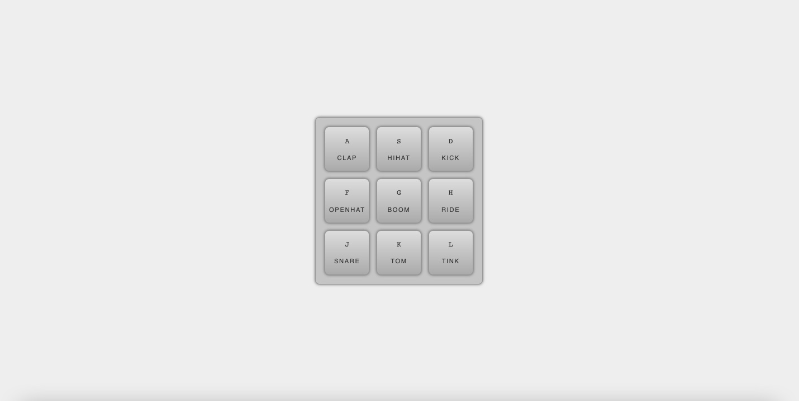

# JavaScript Drum Kit

## General Info

A JavaScript music production controller with drum sounds.

Click [here](https://marekjanik.github.io/drum-kit/) to watch it live.

## Technologies

This project is built with Vanilla JavaScript.

## HTML

The HTML structure is based on `
` elements which are created to hold the individual keys.

Each key has a corresponding `<kbd>` element with its name and a `` element with the name of the sound.

The `<audio>` elements store the audio sources that represent the individual drum sounds.

To refer to individual key and `<audio>` elements in JavaScript, the `data-key` attribute is added to each of them.

## CSS

All elements are positioned in the center of the page using Flexbox.

Keys are wrapped into multiple lines thanks to the `flex-wrap: wrap` property.

The `box-shadow` property and `linear-griadient()` CSS function is applied to give the impression of realistic shape of the controller and its keys.

The `transition` property in the `.key` class is applied to collaborate with `.playing` class, added via JavaScript, which changes the size and the border color of a pressed key.

## JavaScript

Firstly, the `playSound(event)` function is declared. The event parameter represents an object containing information about the action that just happened in the browser. The function works as follows:

- return the value of the key pressed by the user by the JavaScript `event.key` property applied to the event. Assign that value as a template string in the `data-key` property of an `<audio>` element,

- get the selected `<audio>` element from the DOM and assign it to the `audio` variable,

- return the value of the key pressed by the user by the JavaScript `event.key` property applied to the event. Assign that value as a template string in the `data-key` property of a `.key` element,

- get the selected `.key` element from the DOM and assign it to the `key` variable,

- to prevent an error of selecting a `null` element when pressing an invalid key, an `if` statement is declared which checks if the pressed key is an `audio` variable. If it isn't, it stops the function,

- set the value of the current second for the `audio` element to 0 with the JavaScript `currentTime` property. When setting this property, the playback will start from the beginning each time the key is pressed,

- play the sound stored in the `audio` variable with the JavaScript `play()` method,

- add the `.playing` class to the pressed `key` element.

Next, the `removeTransition()` function is declared which will remove the `.playing` class from the current `key` element.

The `keys` variable is declared which stores all the `.key` elements from DOM.

The `forEach()` method executes the `removeTransition()` function for each `keys` element within an `addEventListener()` method with `'transitionend'` as an event type.

Finally, the `playSound(event)` function is called within an `addEventListener()` method with `'keydown'` as an event type.

## Things I Have Learned

| Syntax          | Description                                                                                         |
| --------------- | --------------------------------------------------------------------------------------------------- |
| data-\*         | A HTML attribute which stores custom data in HTML elements and can be referred to in the JavaScript |
| `<audio>`       | A HTML element representing an Internet resource in the form of an audio file                       |
| Event           | An object containing information about the action that just happened in the browser                 |
| event.key       | Returns the value of the key pressed by the user                                                    |
| currentTime     | Sets or returns the current position (in seconds) of the audio/video playback                       |
| play()          | Starts playing the current audio or video                                                           |
| 'transitionend' | An event which occurs when a CSS transition has completed                                           |

## Sources

This project is based on [#JavaScript30](https://javascript30.com/) coding challenge by Wes Bos.
